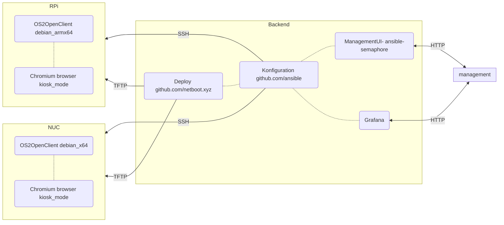

# os2openclient
Linux configuration management, OS deployment and monitoring.

## Architecture proposal

```mermaid

graph RL

subgraph management
end

subgraph NUC
debarm(OS2OpenClient debian_x64)-.-
app2(Chromium browser kiosk_mode)
end


subgraph RPi
debx64(OS2OpenClient debian_armx64)-.-
app1(Chromium browser kiosk_mode)
end

subgraph Backend
logengine(Grafana)
configman(Konfiguration github.com/ansible);
netboot(Deploy github.com/netboot.xyz);
semaphore(ManagementUI- ansible-semaphore);
end

configman-.-netboot
management<--HTTP-->semaphore & logengine
configman--SSH-->RPi & NUC
netboot--TFTP-->RPi & NUC
semaphore & logengine-.-configman


```
