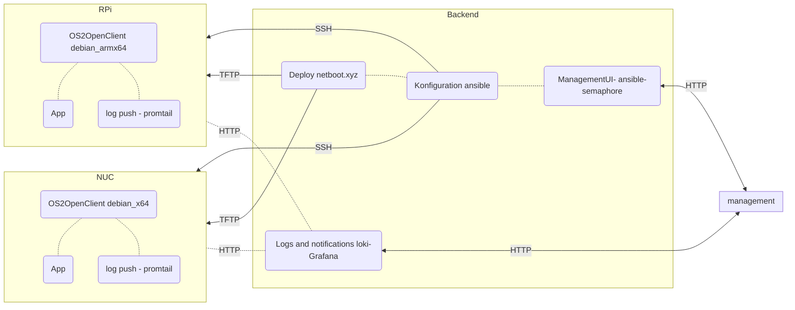

# os2openclient
Linux configuration management, OS deployment and monitoring.

## Quick start guide
- Make sure your demo enviroment has docker and compose installed
- Clone this repo to your demo enviroment
- Open a terminal, cd into the root of the cloned repo
- Run docker compose up
- The semaphore UI is availble on port 3000 in a browser

## Architecture proposal

### Cornerstone backend components:
- Secure Push based device management & Automation - [Ansible](https://www.ansible.com/overview/how-ansible-works)
- Operating systems deployment  - [netboot.xyz](https://netboot.xyz/docs)
- Obeservability and notifications - [Promtail-Loki-Grafana](https://grafana.com/oss/loki/) - MQTT datasource + Grafana could be a simpler alternative, requires a mqtt client instead of a promtail client.

### Clients
- debian for arm and x64 devices
- SSH enabled for secure clientless managment
- promtail client for logging
- Ready to support Apps and services from e.g. os2display, os2borgerpc or other projects running apps on devices. 

