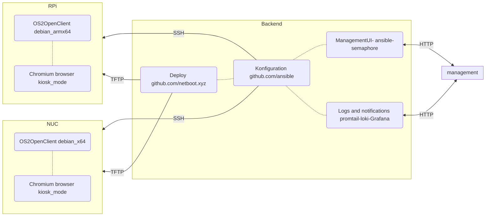

# os2openclient
Linux configuration management, OS deployment and monitoring.

## Architecture proposal

### Cornerstone backend components:
- Secure Push based device management & Automation - [Ansible](https://www.ansible.com/overview/how-ansible-works)
- Operating systems deployment  - [netboot.xyz](https://netboot.xyz/docs)
- Obeservability and notifications - [Promtail-Loki-Grafana](https://grafana.com/oss/loki/)

### Clients
- debian for arm and x64 devices
- SSH enabled for secure clientless managment
- promtail client for logging
- Ready to support Apps and services from e.g. os2display, os2borgerpc or other projects running apps on devices. 

