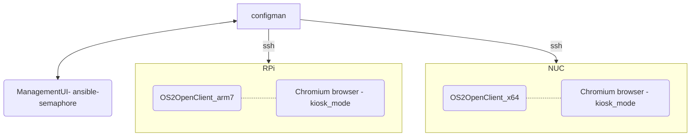

# os2openclient
linux configuration management and deployment

## Architecture proposal

```mermaid
flowchart TB

semaphore(ManagementUI- ansible-semaphore);

subgraph NUC
debarm(OS2OpenClient_x64)-.-
app2(Chromium browser - kiosk_mode)
end

subgraph RPi
debx64(OS2OpenClient_arm7)-.-
app1(Chromium browser - kiosk_mode)
end

configman<-->semaphore
configman--ssh-->RPi & NUC

```
