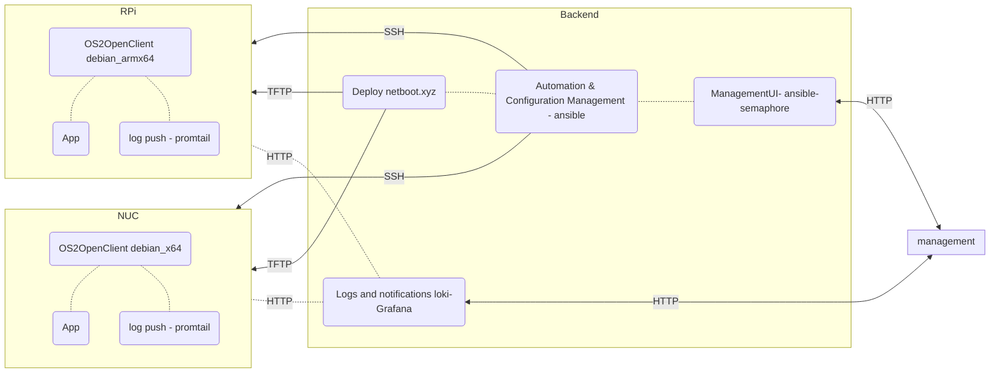

# 📱 os2openclient
Standards based Linux configuration management, OS deployment and monitoring.

#### Executive summary in Danish 🇩🇰:
*Vi arbejder på at skabe en simpel, standardiseret og åben platform, der gør det nemt at implementere, administrere og overvåge applikationer. Vores projekt er baseret på et åbent operativsystem og bruger kendte standard værktøjer til at sikre en problemfri drift. Formålet er at tjene som det grundlæggende system for forskellige løsninger, såsom digitale skilte og offentlige tilgængelige internet pcere.*

## Quick start guide
- Make sure your demo enviroment has docker and compose installed
- Open SSH on port 22 on the device you want to manage and add it to same network as the demo enviroment.
- Clone this repo to your demo enviroment
- Open a terminal, cd into the root of the cloned repo
- Run docker compose up
- The semaphore UI is availble on port 3000 in a browser

## Architecture proposal

### Cornerstone backend components:
- Secure Push based device management & Automation - [Ansible](https://www.ansible.com/overview/how-ansible-works)
- Operating systems deployment  - [netboot.xyz](https://netboot.xyz/docs)
- Obeservability and notifications - [Promtail-Loki-Grafana](https://grafana.com/oss/loki/) - MQTT datasource + Grafana could be a simpler alternative, requires a mqtt client and a brooker service instead of a promtail client.
- Dynamic inventories with device IPs and IDs from promtail/syslog pushes.

### Clients
- debian for arm and x64 devices
- SSH enabled for secure clientless managment
- promtail client for logging
- Ready to support Apps and services from e.g. os2display, os2borgerpc or other projects running apps on devices. 

